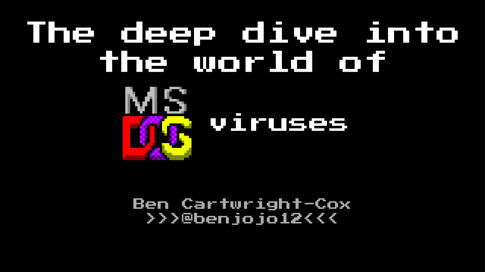

A Deep Dive into the world of MS-DOS viruses
===

These are the tools that I wrote as a part of my talk, These are not fully intended to be used, however you can happily take bits from them if you need them as long as you respect the licence.

It's worth mentioning that none of this code should be considered that great, it's mostly been written in a rush to get the talk done.

### BenX86

I don't know why you would want this, but the program is designed to interact with webui to pull code down, and then submit new subtasks to be completed, it does this by using a very bad x86 emulator to find date/time variations in the code path.

### Jobserver

this is the core of the system, this allows many programs and servers to work on tasks, This also runs the SQLLite3 database.

### RecordandTrace

this is the program that deals with testing a sample, gets jobs from jobserver and submits to it after it's done.

### int20h-gdb-trace

Simple version of the tracer.

## Requirements

Capstone:

`apt install libcapstone-dev`

flv2rec:

`apt install python-pip`
`pip install flv2rec`

QEMU:

`apt install qemu`

**WARNING, I can't confirm if this works on any other version of qemu other than Debian 9's, I know this sounds nuts, but trust me on this one**

Fatboy:

Compile it from `https://github.com/John-K/fatboy` and install it to /usr/bin/

